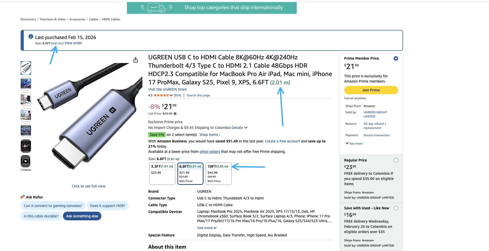
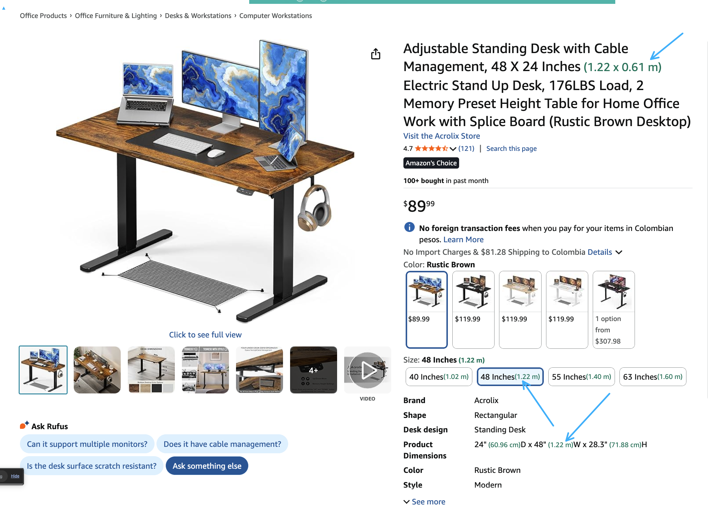

# Amazon Imperial to Metric

Chrome extension that automatically converts feet and inches to meters and centimeters on Amazon product pages.




## Install locally

1. Clone and build:
   ```sh
   git clone https://github.com/dan/chrome-metrics-changer.git
   cd chrome-metrics-changer
   npm install
   npm run build
   ```

2. Open `chrome://extensions` in Chrome, enable **Developer mode**, click **Load unpacked**, and select this folder.
